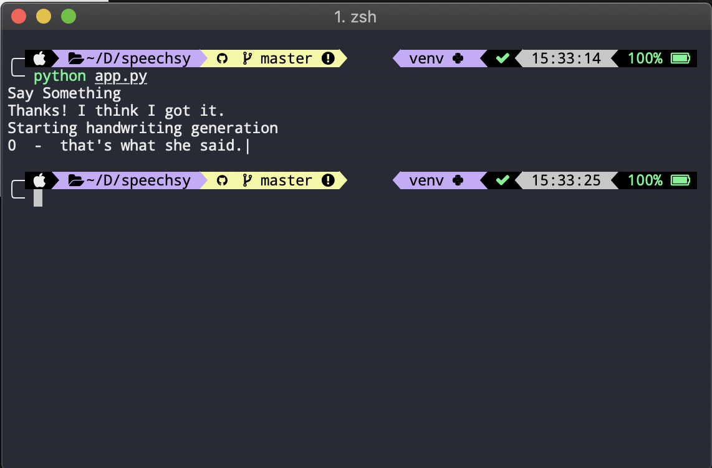

# Speechsy
## Voice to Handwritten letters.

Just say what you want to write and Speechsy will write it out for you.

## Demo
 

### Requirements
- Pillow
- Requests
- SpeechRecognition
- PyAudio

Handwriting generation was achieved using Recurrent Neural Networks based on an implementation from 
[here](https://github.com/theSage21/handwritten).

